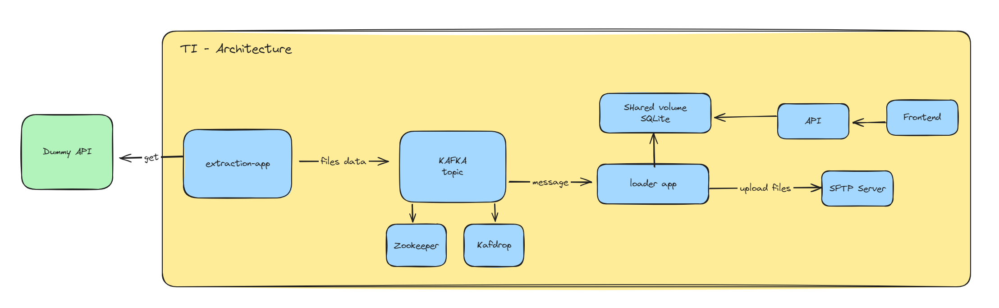

# Telus - Technical Challenge

## Table of Contents

- [Architecture](#architecture)
- [Technologies](#technologies)
- [Installation](#installation)
- [Usage](#usage)
- [Contributing](#contributing)
- [License](#license)

## Architecture

## Technologies

- Python
- Flask
- SQLite
- HTML
- CSS
- JavaScript
- Chart.js

## Installation

- Clone the repo

- Set .env file in the root. Set this variables:
    - SFTP_USER= {SFTP user, it will configure this user in the server}
    - SFTP_PASSWORD= {SFTP passwords , it will configure this password in the server}
    - SFTP_PORT= {it has to match with the SFTP port, in this case 22}

- Located at the root of the project, run:

    `docker compose up`

- In the docker desktop, you will see all of this containers up and running

## License

This project is licensed under the MIT License. For more details, see the [LICENSE](LICENSE) file.
