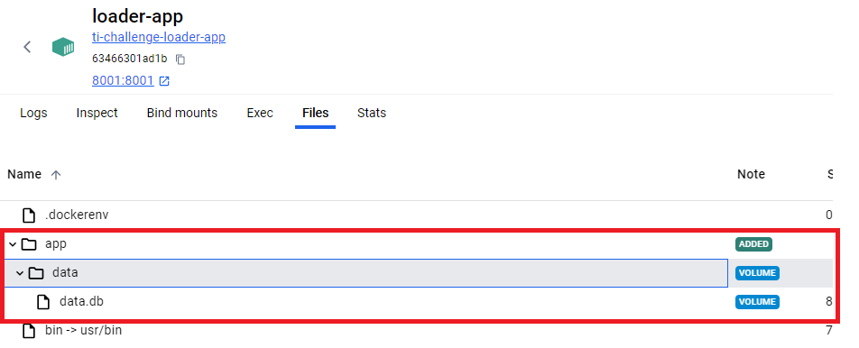
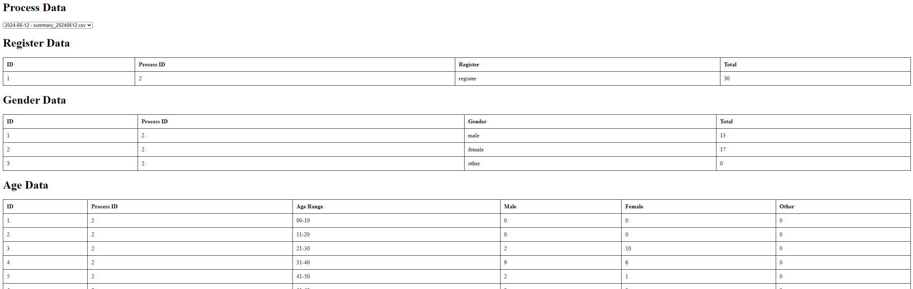

# Telus - Technical Challenge

## Table of Contents

- [Architecture](#architecture)
- [Technologies](#technologies)
- [Installation](#installation)
- [Usage](#usage)
- [API Documentation](#api-documentation)
- [Frontend](#frontend)
- [License](#license)

## Architecture

## Technologies

- Python
- Flask
- SQLite
- HTML
- CSS
- JavaScript
- Chart.js

## Installation

- Clone the repo

- Set .env file in the root. Set this variables:
    - SFTP_USER= {SFTP user, it will configure this user in the server}
    - SFTP_PASSWORD= {SFTP passwords , it will configure this password in the server}
    - SFTP_PORT= {it has to match with the SFTP port, in this case 22}

- Located at the root of the project, run:

    `docker compose up`

- In the docker desktop, you will see all of this containers up and running

## Usage

This process is intended to run every day at 00:00hs. For testing purposes, you can modify the file 'scheduler.py' inside the path extraction-app/core/ with the following line: 

`schedule.every(5).minutes.do(fetch_and_save_data)`

To connect to the db, you can access the data.db file located in the "Files" tab in the loader-app and api-1 (shared volume) containers.

You can use FTP tools like WINScp (https://winscp.net/eng/download.php) to connect to the SFTP server and check the generated files

## API Documentation

The API provides several endpoints to interact with the data stored in the database. Below is a detailed description of each endpoint, including the HTTP method, URL, parameters, and a brief description of its functionality.

### Endpoints

1. **Get Process Headers**
    - **URL:** `/api/process_header`
    - **Method:** `GET`
    - **Description:** Retrieves all process headers.

2. **Get ETL Data**
    - **URL:** `/api/etl_data`
    - **Method:** `GET`
    - **Description:** Retrieves all ETL data.

3. **Get Register Data**
    - **URL:** `/api/register_data`
    - **Method:** `GET`
    - **Parameters:**
      - `process_id` (optional): Filter by process ID.
    - **Description:** Retrieves register data, optionally filtered by process ID.

4. **Get Gender Data**
    - **URL:** `/api/gender_data`
    - **Method:** `GET`
    - **Parameters:**
      - `process_id` (optional): Filter by process ID.
    - **Description:** Retrieves gender data, optionally filtered by process ID.

5. **Get Age Data**
    - **URL:** `/api/age_data`
    - **Method:** `GET`
    - **Parameters:**
      - `process_id` (optional): Filter by process ID.
    - **Description:** Retrieves age data, optionally filtered by process ID.

6. **Get City Data**
    - **URL:** `/api/city_data`
    - **Method:** `GET`
    - **Parameters:**
      - `process_id` (optional): Filter by process ID.
    - **Description:** Retrieves city data, optionally filtered by process ID.

7. **Get OS Data**
    - **URL:** `/api/os_data`
    - **Method:** `GET`
    - **Parameters:**
      - `process_id` (optional): Filter by process ID.
    - **Description:** Retrieves OS data, optionally filtered by process ID.

## Frontend Functionality

### Key Features

1. **Process Selection:**
    - **Dropdown Menu:** Users can select a process from a dropdown menu to view the associated summary data.

2. **Data Display:**
    - **Tables:** The application displays data in organized tables, including:
        - Register Data
        - Gender Data
        - Age Data
        - City Data
        - OS Data

3. **Charts:**
    - **Gender Distribution Chart:** A pie chart that visualizes the distribution of genders (male, female, other) based on the selected process.
    - **OS Distribution Chart:** A pie chart that visualizes the distribution of operating systems (Windows, Apple, Linux) based on the selected process.
    - **Responsive Design:** Charts are responsive and adjust their size based on the window size, providing an optimal viewing experience on different devices.

4. **Interactive Elements:**
    - **Real-time Data Filtering:** Users can filter data in real-time by selecting different processes, which updates the displayed data and charts accordingly.

## License

This project is licensed under the MIT License. For more details, see the [LICENSE](LICENSE) file.
